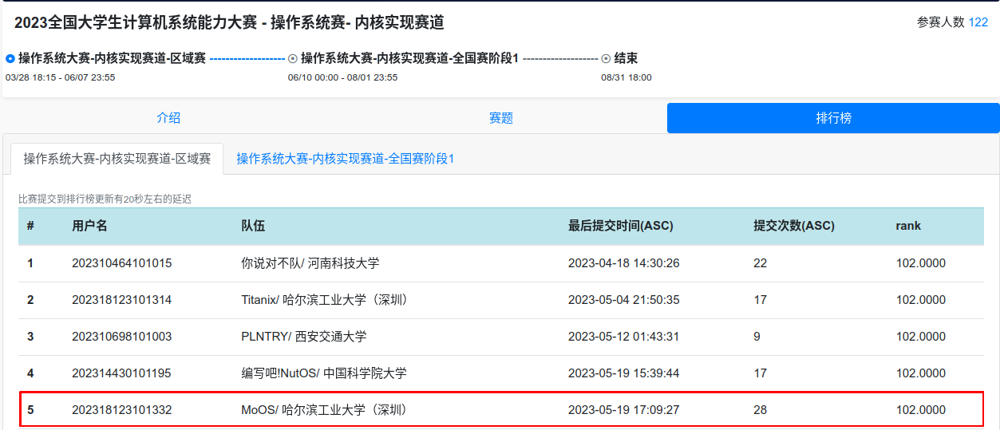

# OSKernel2023-MoOS

操作系统大赛-内核实现赛道-区域赛排行榜



## 项目介绍

### 内核相关目录结构

- `boards`: 存放针对不同硬件板（例如 QEMU）的适配代码。
  - `qemu.rs`: QEMU 适配代码。
- `config.rs`: 存放系统配置信息。
- `console.rs`: 控制台相关代码，包括输入输出处理等。
- `entry.asm`: 系统入口汇编文件，程序的入口点。
- `fs`: 文件系统相关代码。
- `lang_items.rs`: Rust 语言特性项，如 panic handler 等。
- `linker.ld`: 链接脚本，定义程序的内存布局。
- `main.rs`: 主程序文件，程序启动的主要入口。
- `mm`: 内存管理相关的代码。
- `sbi.rs`: 系统二进制接口（SBI）相关的代码。
- `sync`: 同步相关的代码。
- `syscall`: 系统调用相关的代码。
- `task`: 任务调度和进程管理相关的代码。
- `timer.rs`: 计时器相关的代码。
- `trap`: 中断和异常处理相关的代码。
- `user_bin.S`: 用户程序的二进制启动文件。

### 文件系统 (fs)

<!-- - `dev`: 设备相关的代码。
  - `block_cache.rs`: 块设备缓存的代码。
  - `std_impl.rs`: 标准设备实现。
  - `mod.rs`: 设备模块声明。 -->

- `dirty.rs`: "脏" 文件或页面的处理代码。
- `file.rs`: 文件处理相关的代码。
- `lib.rs`: 文件系统的库文件。
- `std.rs`: 标准文件系统实现。
- `util.rs`: 文件系统工具函数。
- `vfs.rs`: 虚拟文件系统的实现。

### 内存管理 (mm)

- `address.rs`: 地址管理相关的代码。
- `frame_allocator.rs`: 帧分配器的代码。
- `heap_allocator.rs`: 堆分配器的代码。
- `memory_set.rs`: 内存集合的管理代码。
- `page_table.rs`: 页表管理相关的代码。

### 同步 (sync)

- `up.rs`: UP（单处理器）的同步代码。
- `mod.rs`: 同步模块声明。

### 系统调用 (syscall)

- `fs.rs`: 文件系统相关的系统调用。
- `interrupt.rs`: 中断处理相关的系统调用。
- `mm.rs`: 内存管理相关的系统调用。
- `process.rs`: 进程管理相关的系统调用。

### 任务调度 (task)

- `context.rs`: 上下文切换相关的代码。
- `cpu.rs`: CPU 相关的代码。
- `proc.rs`: 进程相关的代码。
- `switch.S`: 上下文切换的汇编实现。

### 中断处理 (trap)

- `context.rs`: 中断上下文相关的代码。
- `trampoline.S`: 中断跳板的汇编实现。

## 开发及运行环境

暂略

<!-- 操作系统: （你的操作系统） -->

<!-- 工具链: Rust (你的 Rust 版本) -->

<!-- 硬件环境: QEMU -->

## 编译运行

暂略

<!-- 请根据以下步骤编译并运行代码： -->

<!-- 1. （编译步骤） -->
<!-- 2. （运行步骤） -->

> 本项目是在开发中，可能会有一些未知的错误和问题，我们欢迎任何形式的反馈和建议。

<!-- # Dependencies

    sudo apt install g++-11-riscv64-linux-gnu

This is for user program compiling.

# Run on QEMU:

    cd os
    make all

### HINTS:

Bulid kernel and run:

    make run

Compile user programs:

    make user

# Progress:

## supported system calls:

```C
int read(int fd, char* buf, int len);//STDIN only
int write(int fd, const char* buf, int len);//STDOUT only
int exit(int code);
int waitpid(int pid,int* stauts,int options);//options not implemented
int getpid(void);
int getppid(void);
int sched_yield(void);
int clone(int flag,void* stack);
int execve(char* path,char** argv,char** env);//env not implemented
int gettimeofday(*timespec ts,int ts);
int nanosleep(const *timespec req,*timespec rem);//rem not implemented
```

## passed tests
```C
	"getpid",
	"getppid",
	"write",
	"gettimeofday",
	"sleep",
	"wait",
	"waitpid",
	"exit",
	"execve",
	"test_echo",
	"fork",
	"times",
	"yield",
	"clone",
	"yield",
```

# yet to do:

### File system

```c
#define SYS_openat 56
#define SYS_close 57
#define SYS_getcwd 17
#define SYS_getdents64 61 ?
#define SYS_read 63
#define SYS_write 64
#define SYS_mkdirat 34 ?
#define SYS_fstat 80
```

### Process

```c
```

### Memory

```c
#define SYS_brk 214
#define SYS_munmap 215
#define SYS_mmap 222
```

### Tests
``` C
	"times",
	...
``` -->
